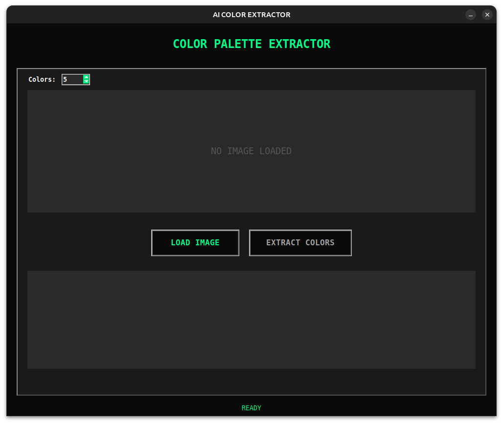
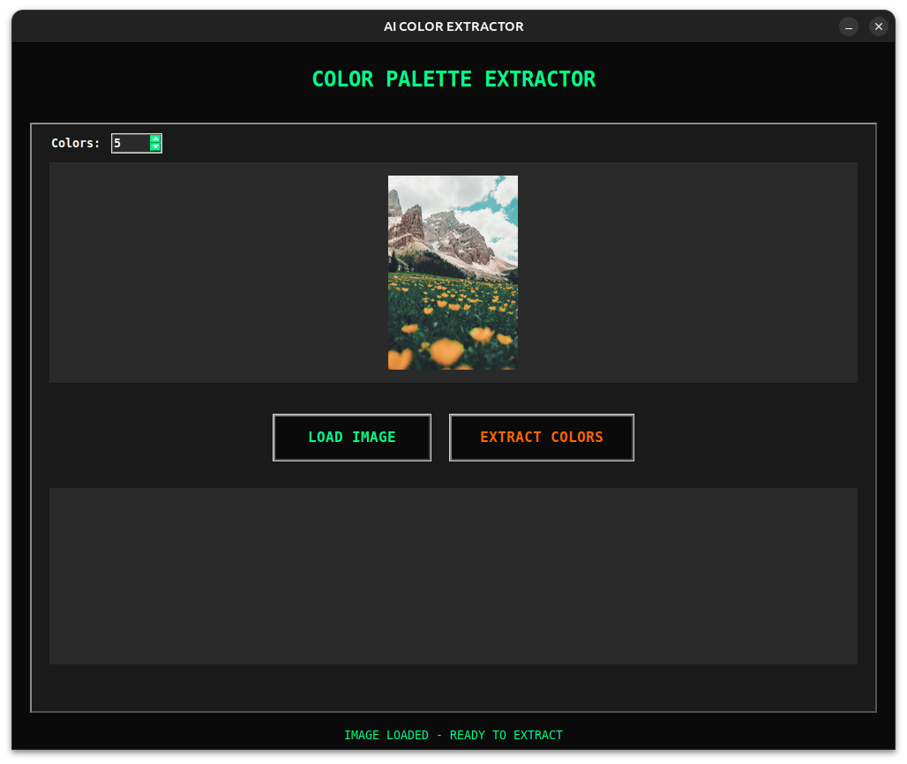
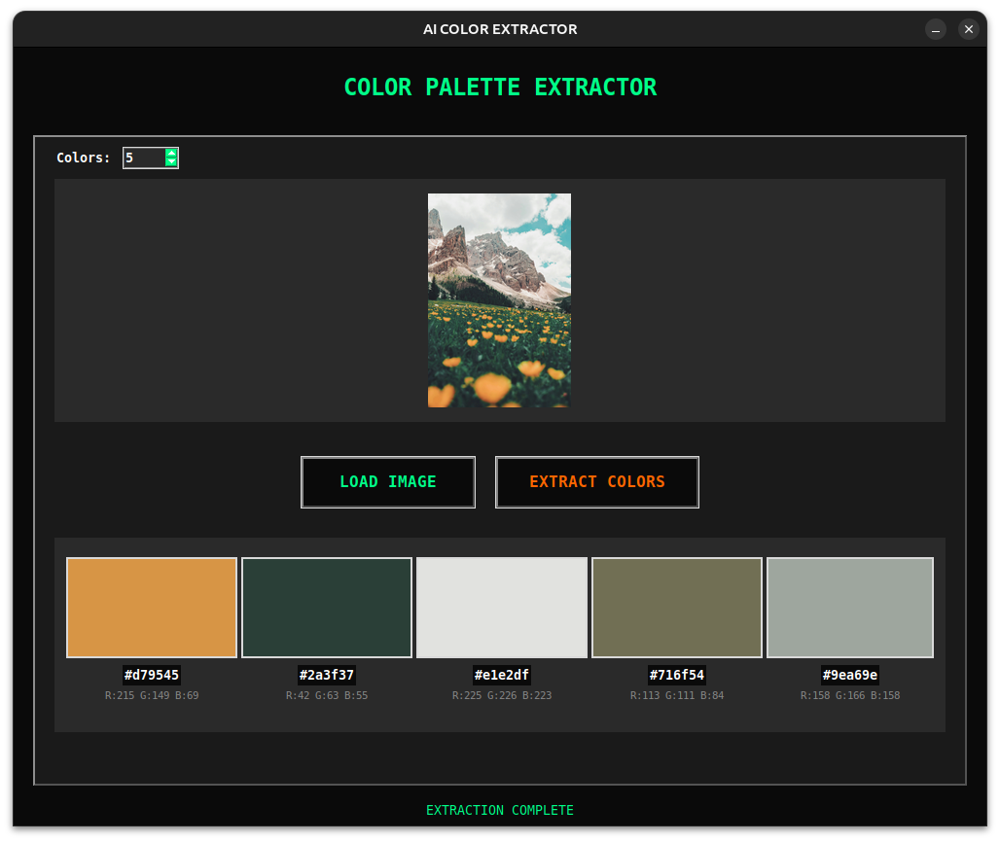

# 🎨 AI Color Palette Extractor

A modern, futuristic color palette extraction tool built with Python that uses machine learning to extract dominant colors from any image.



## ✨ Features

- **Modern Dark UI** - Sleek, futuristic interface with neon accents
- **AI-Powered Extraction** - Uses K-means clustering to find dominant colors
- **Flexible Color Count** - Extract 3-8 colors from any image
- **Multiple Formats** - Get both HEX and RGB values
- **Click to Copy** - Easy clipboard functionality for quick use
- **Smooth Animations** - Professional fade-in effects
- **Image Preview** - See your image before extraction
- **Real-time Status** - Live feedback during processing

## 🚀 Quick Start

### Prerequisites

```bash
pip install opencv-python scikit-learn pillow tkinter numpy
```

### Installation

```bash
git clone https://github.com/djoga98/micro-projects.git
cd micro-projects/ai-ml/color-palette-ai
python main.py
```

## 🛠️ Tech Stack

- **Python 3.7+** - Core programming language
- **OpenCV** - Image processing and manipulation
- **Scikit-learn** - K-means clustering algorithm
- **Tkinter** - GUI framework
- **PIL (Pillow)** - Image handling and thumbnails
- **NumPy** - Numerical operations

## 📖 How It Works

1. **Image Loading** - Load any image format (JPG, PNG, BMP, TIFF)
2. **Preprocessing** - Resize image for optimal processing speed
3. **K-Means Clustering** - Machine learning algorithm groups similar colors
4. **Color Extraction** - Extract cluster centers as dominant colors
5. **Display** - Show colors with HEX and RGB values

## 🎯 Usage

1. Launch the application
2. Click "LOAD IMAGE" and select your image
3. Choose number of colors (3-8) using the spinner
4. Click "EXTRACT COLORS" to analyze
5. Click any color to copy its HEX code to clipboard

## 🔧 Configuration

All styling and behavior can be customized by modifying the constants at the top of `main.py`:

```python
# Window settings
WINDOW_WIDTH = 1000
WINDOW_HEIGHT = 800

# Color scheme
BG_COLOR = '#0a0a0a'
ACCENT_COLOR = '#00ff88'

# Algorithm parameters
DEFAULT_COLORS = 5
IMAGE_RESIZE_WIDTH = 150
```

## 📸 Screenshots

| Feature          | Screenshot              |
| ---------------- | ----------------------- |
| Main Interface   |       |
| Color Extraction |  |
| Palette Display  |  |

## 📝 Future Enhancements

- [ ] Export palettes to Adobe Swatch files (.ase)
- [ ] Color harmony suggestions (complementary, triadic, etc.)
- [ ] Batch processing multiple images
- [ ] Color accessibility analysis
- [ ] Export to various formats (CSS, SCSS, JSON)
- [ ] Drag & drop image support
- [ ] Recently used images history

## 📄 License

This project is licensed under the MIT License - see the [LICENSE](../../LICENSE) file for details.

## 👨‍💻 Author

**Slavko Đogić**

- GitHub: [@djoga98](https://github.com/djoga98)
- LinkedIn: [@djogicslavko](https://linkedin.com/in/djogicslavko)
- TikTok: [@tensorix](https://tiktok.com/@tensorix)

## 🙏 Acknowledgments

- K-means clustering algorithm from scikit-learn
- Color theory inspiration from Adobe Color
- UI design inspired by modern developer tools

## ⭐ Star this repo

If you found this project helpful, please consider giving it a star! It helps others discover the project.
