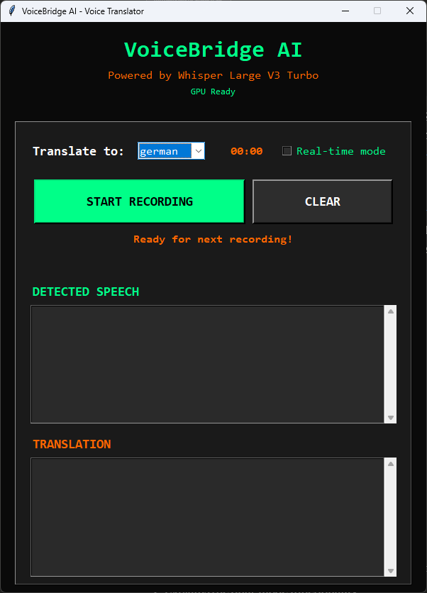

# 🎤 VoiceBridge AI - Real-time Voice Translator

> _"Breaking language barriers with the power of AI"_

A cutting-edge real-time voice translation application powered by OpenAI's Whisper Large V3 Turbo and Google Translate. Features both live streaming translation and traditional record-translate modes with intelligent multi-monitor positioning for content creation.



## ✨ Features

### 🎯 **Dual Translation Modes**

- **Real-time Mode** - Continuous live translation as you speak
- **Recording Mode** - Traditional record, stop, and translate workflow
- **Smart Voice Detection** - Automatic silence filtering and voice activity detection
- **Instant Feedback** - Sub-second processing with Whisper Turbo

### 🌍 **Multi-language Support**

- **100+ Languages** - Full Google Translate language support
- **Auto-detection** - Automatic source language identification
- **Smart Formatting** - Preserves natural speech patterns
- **Bidirectional Translation** - Any language to any language

### 🖥️ **Content Creator Features**

- **Multi-monitor Support** - Intelligent window positioning across displays
- **TikTok Ready** - Pre-configured layouts for social media content
- **Futuristic UI** - Dark theme with neon accents perfect for demos
- **Performance Metrics** - Real-time processing speed display

### ⚡ **AI Performance**

- **GPU Acceleration** - CUDA support for lightning-fast processing
- **Whisper Large V3 Turbo** - State-of-the-art speech recognition
- **Memory Optimized** - Efficient resource usage
- **Background Processing** - Non-blocking UI with threaded operations

## 🚀 Quick Start

### Prerequisites

```bash
pip install torch transformers pyaudio tkinter numpy deep-translator librosa
```

### CUDA Setup (Optional - for GPU acceleration)

```bash
# Install CUDA-enabled PyTorch
pip install torch torchvision torchaudio --index-url https://download.pytorch.org/whl/cu118
```

### Installation

```bash
git clone https://github.com/djoga98/micro-projects.git
cd micro-projects/ai-ml/voice-bridge-ai
python main.py
```

### Quick Demo

```bash
# Default positioning (center)
python main.py

# Side monitor for TikTok demos
# Edit main() function: config = demo_configs["side_monitor"]

# Corner positioning for presentations
# Edit main() function: config = demo_configs["corner_demo"]
```

## 🛠️ Tech Stack

| Component              | Technology             | Purpose                                |
| ---------------------- | ---------------------- | -------------------------------------- |
| **Speech Recognition** | Whisper Large V3 Turbo | Ultra-fast, accurate transcription     |
| **Translation**        | Google Translate API   | 100+ language support                  |
| **Audio Processing**   | PyAudio + librosa      | Real-time audio capture and processing |
| **AI Framework**       | PyTorch + Transformers | GPU-accelerated inference              |
| **UI Framework**       | Tkinter                | Cross-platform desktop interface       |
| **Multi-threading**    | Python threading       | Non-blocking real-time processing      |

## 📖 How It Works

### Real-time Translation Pipeline

```python
1. Audio Capture (3-second chunks) →
2. Voice Activity Detection →
3. Whisper Transcription →
4. Google Translation →
5. Live UI Update
```

### Recording Mode Workflow

```python
1. Start Recording →
2. Capture Full Audio →
3. Stop & Process →
4. Whisper Analysis →
5. Translation & Display
```

### Smart Window Positioning

```python
# Multi-monitor detection and positioning
demo_configs = {
    "main_screen": (WindowPosition.CENTER, 0, 0, 0),
    "side_monitor": (WindowPosition.LEFT_CENTER, 1, 100, -150),
    "corner_demo": (WindowPosition.TOP_RIGHT, 0, -50, 50),
    "presentation": (WindowPosition.BOTTOM_CENTER, 0, -100)
}
```

## 🎮 Usage Guide

### Basic Translation

1. **Launch** the application
2. **Wait** for "Turbo Ready!" status
3. **Select** target language from dropdown
4. **Click** "START RECORDING" and speak
5. **Click** "STOP RECORDING" to see translation

### Real-time Mode

1. **Check** "Real-time mode" checkbox
2. **Start speaking** - translation appears live
3. **Pause** for processing between sentences
4. **Uncheck** to return to recording mode

### Multi-monitor Setup

```python
# Edit main() function for your setup
config = demo_configs["side_monitor"]  # For dual monitor
position, monitor, offset_x, offset_y = config

# Available positions:
# TOP_LEFT, TOP_RIGHT, BOTTOM_LEFT, BOTTOM_RIGHT
# CENTER, TOP_CENTER, BOTTOM_CENTER
# LEFT_CENTER, RIGHT_CENTER
```

## ⚙️ Configuration

### Audio Settings

```python
CHUNK = 1024              # Audio buffer size
RATE = 16000             # Sample rate (Whisper optimized)
REALTIME_CHUNK_DURATION = 3  # Seconds per processing chunk
```

### UI Customization

```python
# Colors - Futuristic theme
BG_COLOR = '#0a0a0a'        # Background
ACCENT_COLOR = '#00ff88'     # Primary accent (green)
SECONDARY_COLOR = '#ff6600'  # Secondary accent (orange)
ERROR_COLOR = '#ff4757'      # Error indicators
```

### Window Positioning

```python
WINDOW_WIDTH = 600
WINDOW_HEIGHT = 804

# Position on specific monitor with offset
WindowPositioner.set_tkinter_window_position(
    window, WindowPosition.TOP_RIGHT,
    monitor_index=1, offset_x=50, offset_y=50
)
```

## 🎯 Use Cases

### Content Creation

- **TikTok Videos** - Live translation demonstrations
- **YouTube Tutorials** - Multi-language accessibility
- **Twitch Streams** - Real-time chat translation
- **Educational Content** - Language learning tools

### Professional Applications

- **International Meetings** - Real-time interpretation
- **Customer Support** - Multi-language assistance
- **Travel Assistance** - On-the-go translation
- **Accessibility** - Voice-to-text with translation

### Development & Testing

- **AI Model Comparison** - Whisper vs other models
- **Language Accuracy Testing** - Translation quality assessment
- **Performance Benchmarking** - Speed and accuracy metrics
- **UI/UX Prototyping** - Interface design testing

## 🔧 Troubleshooting

### Common Issues

```bash
# Audio device not found
# Solution: Check microphone permissions and PyAudio installation

# Model loading fails
# Solution: Ensure stable internet for Whisper model download

# CUDA out of memory
# Solution: Reduce batch size or use CPU mode

# Translation API errors
# Solution: Check internet connection and Google Translate availability
```

### Debug Mode

```python
# Enable verbose logging
import warnings
warnings.filterwarnings("default")  # Show all warnings

# Check CUDA availability
print(f"CUDA Available: {torch.cuda.is_available()}")
print(f"Device: {torch.cuda.get_device_name()}")
```

## 🚀 Future Enhancements

- [ ] **Offline Translation** - Local translation models
- [ ] **Voice Cloning** - Maintain speaker's voice in translation
- [ ] **Video Integration** - Real-time video subtitle translation
- [ ] **API Server Mode** - REST API for integration
- [ ] **Mobile App** - iOS/Android companion app
- [ ] **Plugin System** - Extensible translation backends
- [ ] **Cloud Sync** - Translation history and preferences
- [ ] **Custom Models** - Fine-tuned domain-specific translations

## 📄 License

This project is licensed under the MIT License - see the [LICENSE](../../LICENSE) file for details.

## 👨‍💻 Author

**Slavko Đogić**

- GitHub: [@djoga98](https://github.com/djoga98)
- LinkedIn: [@djogicslavko](https://linkedin.com/in/djogicslavko)
- TikTok: [@djoga98](https://tiktok.com/@djoga98)

## 🙏 Acknowledgments

- **OpenAI** - For the revolutionary Whisper speech recognition model
- **Google** - For the comprehensive Google Translate API
- **Hugging Face** - For the transformers library and model hosting
- **PyTorch Team** - For the exceptional deep learning framework
- **Python Community** - For the robust ecosystem of libraries

## ⭐ Star this repo

If VoiceBridge AI helped you break language barriers or create amazing content, please consider giving it a star! ⭐
