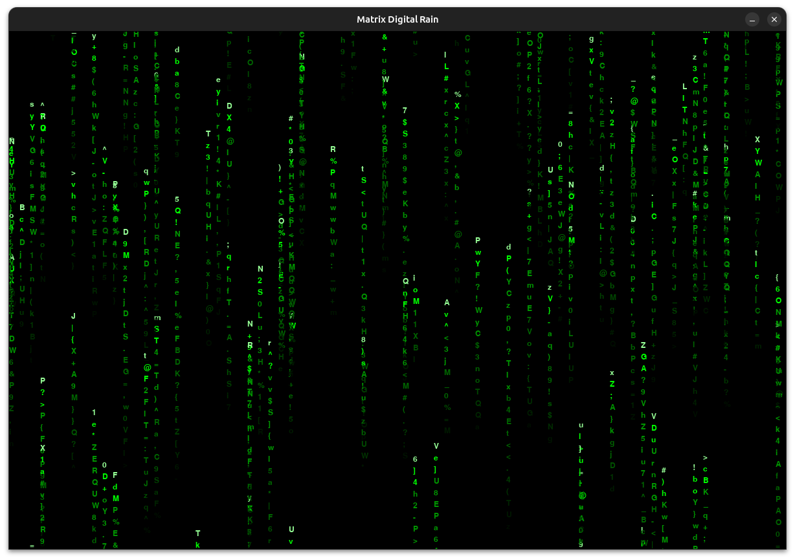

# 🔴 Matrix Digital Rain

> *"Wake up, Neo... The Matrix has you."*

A faithful recreation of the iconic digital rain effect from The Matrix movie, featuring both terminal and graphical implementations built with Python.



## ✨ Features

### 🖥️ **Dual Interface**
- **CLI Mode** - Authentic terminal-based matrix rain
- **GUI Mode** - High-quality graphical simulation with Pygame
- **Interactive Launcher** - Choose your preferred experience

### 🎨 **Visual Effects**
- **Dynamic Character Generation** - Randomized matrix characters
- **Realistic Trails** - Varying brightness and fade effects
- **Multiple Green Shades** - True-to-movie color palette
- **Glitch Effects** - Characters randomly change for authenticity
- **Smooth Animation** - 60 FPS rendering in GUI mode

### ⚙️ **Customizable**
- Adjustable drop speeds and trail lengths
- Configurable spawn rates and character sets
- Responsive to different terminal/window sizes
- Easy-to-modify configuration constants

## 🚀 Quick Start

### Prerequisites
```bash
pip install pygame
```

### Installation
```bash
git clone https://github.com/djoga98/micro-projects.git
cd micro-projects/graphics-effects/matrix
python main.py
```

### Direct Mode Access
```bash
# CLI only
python cli.py

# GUI only (requires pygame)
python gui.py
```

## 🛠️ Tech Stack

| Component | Technology | Purpose |
|-----------|------------|---------|
| **CLI Mode** | Pure Python + ANSI | Terminal-based simulation |
| **GUI Mode** | Pygame | High-performance graphics |
| **Launcher** | subprocess + pathlib | User interface management |
| **Effects** | Custom algorithms | Realistic matrix animation |

## 📖 How It Works

### CLI Implementation
```python
class MatrixDrop:
    def __init__(self, x, y, length):
        self.chars = [random.choice(MATRIX_CHARS) for _ in range(length)]
        self.speed = random.uniform(0.8, 1.5)
    
    def update(self):
        self.y += self.speed
        # Glitch effect - randomly change characters
        if random.random() < 0.1:
            self.chars[random.randint(0, len(self.chars)-1)] = random.choice(MATRIX_CHARS)
```

### GUI Implementation
- **Object-oriented design** with separate Drop and Simulation classes
- **Optimized rendering** with brightness-based color selection
- **Memory management** with automatic cleanup of off-screen drops
- **Event handling** for smooth user interaction

## 🎮 Controls

### CLI Mode
- `Ctrl+C` - Return to main menu
- Automatically adapts to terminal size

### GUI Mode
- `ESC` - Exit to main menu
- `Close Window` - Exit application
- Fullscreen experience at 1200x800 resolution

## 🔧 Configuration

### CLI Settings (`cli.py`)
```python
MATRIX_CHARS = "ABCDEFGHIJKLMNOPQRSTUVWXYZabcdefghijklmnopqrstuvwxyz0123456789!@#$%^&*()_+-=[]{}|;:,.<>?"
DROP_SPEED = 0.05          # Animation speed
MIN_TRAIL_LENGTH = 5       # Shortest trails
MAX_TRAIL_LENGTH = 25      # Longest trails
SPAWN_PROBABILITY = 0.3    # New drop frequency
```

### GUI Settings (`gui.py`)
```python
WINDOW_WIDTH = 1200        # Display width
WINDOW_HEIGHT = 800        # Display height
FONT_SIZE = 18            # Character size
FPS = 60                  # Frames per second
SPAWN_RATE = 0.5          # Drop generation rate
```

## 📁 Project Structure

```
matrix/
├── main.py              # Interactive launcher
├── cli.py               # Terminal implementation
├── gui.py               # Pygame implementation
├── requirements.txt     # Dependencies
├── README.md            # Documentation
```

## 🎯 Usage Examples

### Basic Launch
```bash
python main.py
# Select option 1 for CLI or 2 for GUI
```

### CLI Direct
```bash
python cli.py
# Immediate terminal matrix effect
```

### GUI Direct
```bash
python gui.py
# Immediate graphical matrix effect
```

## 📸 Screenshots

| Mode | Preview |
|------|---------|
| **Launcher** |  |
| **CLI Mode** |  |
| **GUI Mode** |  |

## 🎨 Customization Ideas

### Character Sets
```python
# Japanese Matrix style
MATRIX_CHARS = "アイウエオカキクケコサシスセソタチツテトナニヌネノハヒフヘホマミムメモヤユヨラリルレロワヲン"

# Binary Matrix
MATRIX_CHARS = "01"

# Symbols only
MATRIX_CHARS = "!@#$%^&*()_+-=[]{}|;:,.<>?"
```

### Color Schemes
```python
# Blue Matrix
GREEN_COLORS = [(0, 0, 100), (0, 0, 150), (0, 0, 255), (150, 150, 255)]

# Red Matrix
GREEN_COLORS = [(100, 0, 0), (150, 0, 0), (255, 0, 0), (255, 150, 150)]
```

## 🚀 Future Enhancements

- [ ] **Audio Integration** - Matrix movie soundtrack sync
- [ ] **Multiple Character Sets** - Japanese katakana, custom symbols
- [ ] **Interactive Mode** - Mouse hover effects
- [ ] **Screen Saver Mode** - System integration
- [ ] **Config File** - External settings management
- [ ] **Fullscreen Toggle** - F11 fullscreen support
- [ ] **Recording Feature** - Export animations as GIF/MP4
- [ ] **Network Mode** - Distributed matrix across multiple terminals

## 📄 License

This project is licensed under the MIT License - see the [LICENSE](../../LICENSE) file for details.

## 👨‍💻 Author

**Slavko Đogić**
- GitHub: [@djoga98](https://github.com/djoga98)
- LinkedIn: [@djogicslavko](https://linkedin.com/in/djogicslavko)
- TikTok: [@djoga98](https://tiktok.com/@djoga98)

## 🙏 Acknowledgments

- **The Wachowskis** - For creating The Matrix and inspiring countless developers
- **Simon Whiteley** - Original cmatrix inspiration
- **Pygame Community** - Excellent graphics library
- **Python Community** - For making programming accessible and fun

## ⭐ Star this repo

If this project helped you understand graphics programming or just brought back nostalgic Matrix memories, please consider giving it a star! ⭐

---

**Remember:** *There is no spoon.* 🥄